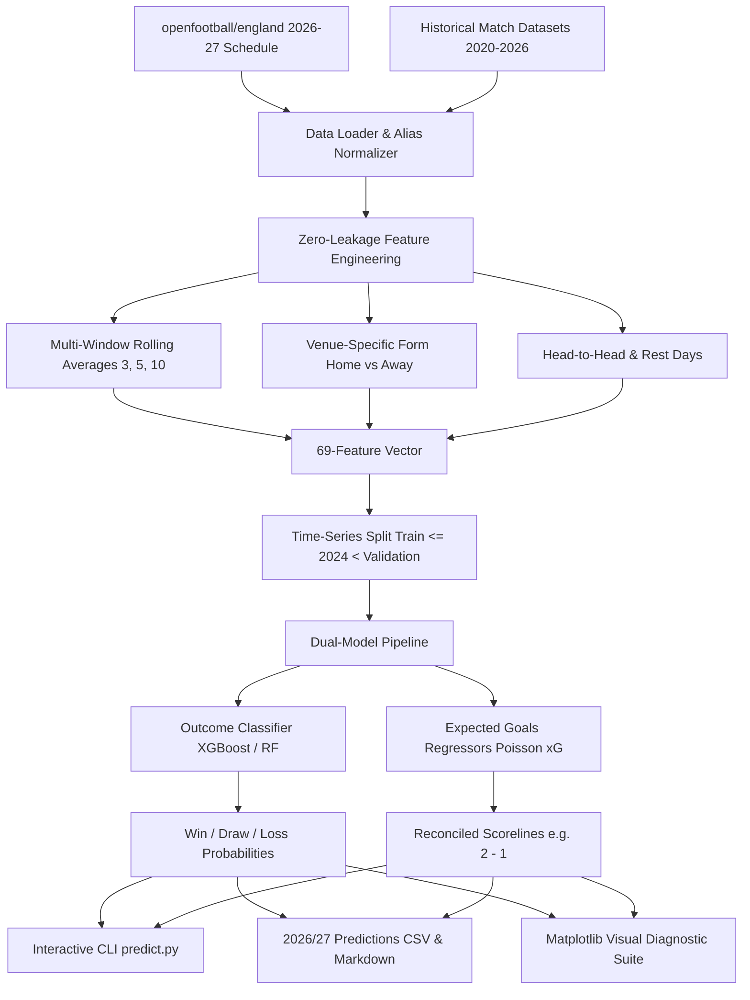

# ⚽ Premier League Match Outcome & Scoreline Predictor (2026/27)

[](https://www.python.org/downloads/)
[](https://xgboost.readthedocs.io/)
[-brightgreen.svg)](tests/)
[](https://github.com/openfootball/england)
[](LICENSE)

An end-to-end predictive machine learning framework and interactive command-line interface (CLI) to forecast English Premier League match outcomes (Win / Draw / Loss probabilities) and exact scorelines for the **2026/2027 season**.

Built using historical Premier League datasets (goals, shots, shots on target, corners, possession) and official schedules from [`openfootball/england`](https://github.com/openfootball/england).

---

## 📌 Architecture Overview



---

## 🚀 Key Features

* **Dual-Model ML Architecture**:
  * **Outcome Classifier**: Multi-class model outputting calibrated 3-way probabilities (`Home Win %`, `Draw %`, `Away Win %`).
  * **Scoreline Regressors**: Poisson-objective estimators predicting continuous expected goals (`Home xG`, `Away xG`), reconciled into integer scorelines.
* **Zero Data Leakage**:
  * All rolling form metrics use strict chronological lagging (`shift(1)`), ensuring no future information leaks into predictions.
* **Rich 69-Dimensional Feature Space**:
  * 3, 5, and 10-match rolling averages of goals scored, goals conceded, goal difference, total shots, shots on target, possession %, and points momentum.
  * Venue-specific performance splits (home advantage modeling).
  * Historical head-to-head records and inter-match rest days.
* **Benchmarking & Model Selection**:
  * Side-by-side time-series validation comparing **Random Forest** and **XGBoost**.
* **Complete 2026/2027 Season Forecasts**:
  * All 380 fixtures parsed from `openfootball/england` with automated rolling updates for played gameweeks.
* **Matplotlib Visual Diagnostics**:
  * High-resolution charts for feature importance, confusion matrix, metric comparisons, and residual distributions.

---

## 📊 Benchmark & Evaluation Results

Evaluated on unseen validation data (944 Premier League matches from 2024–2026):

| Model | Classification Accuracy | Macro F1 | Multi-Class Log Loss | Home Goal MAE | Away Goal MAE | Within 1 Goal Acc | Status |
| :--- | :---: | :---: | :---: | :---: | :---: | :---: | :---: |
| **Random Forest** | 41.5% | 0.360 | 1.070 | 1.01 | 0.95 | 60.4% | Benchmark |
| **XGBoost** | **43.8%** | 0.322 | 1.098 | **0.99** | **0.94** | **60.3%** | **Selected Production Model** |

---

## 📈 Visual Diagnostic Gallery

All diagnostic plots are automatically rendered using Matplotlib and saved to the [`visuals/`](visuals/) directory:

| Diagnostic Chart | Description |
| :--- | :--- |
| **[Feature Importance](visuals/feature_importance.png)** | Top 15 predictive drivers comparing Random Forest and XGBoost. |
| **[Confusion Matrix](visuals/confusion_matrix.png)** | Normalized heatmaps for Win / Draw / Loss classification. |
| **[Metric Comparison](visuals/model_metrics_comparison.png)** | Side-by-side grouped bar chart of accuracy, F1, log loss, and MAE. |
| **[Goal Error Distribution](visuals/goal_error_distribution.png)** | Residuals and distributions comparing predicted vs. actual goals. |

---

## 🛠️ Installation & Setup

### Prerequisites
* Python 3.11 or higher
* [uv](https://github.com/astral-sh/uv) (recommended) or standard `pip`

### 1. Clone the Repository
```bash
git clone https://github.com/Raghav2012Code/epl-predictor.git
cd epl-predictor
```

### 2. Set Up Virtual Environment & Dependencies

#### Using `uv` (Fastest):
```powershell
uv venv --python 3.11 .venv
uv pip install -r requirements.txt
```

#### Using standard `pip`:
```powershell
python -m venv .venv
.\.venv\Scripts\activate
pip install -r requirements.txt
```

---

## 💻 CLI Usage

### Run the Full Pipeline
Ingests data, extracts rolling features, benchmarks models, creates diagnostic plots, and forecasts the 2026/2027 season:
```powershell
.venv\Scripts\python run_pipeline.py
```

### Predict an Upcoming Gameweek (e.g. Gameweek 7)
```powershell
.venv\Scripts\python predict.py --gameweek 7
```
```text
+------------+--------+------------------------------+-------------------+--------------------------------+------------+----------+
| Date       | Time   | Fixture                      | Predicted Score   | Win / Draw / Loss Probs        | Favorite   | Status   |
+============+========+==============================+===================+================================+============+==========+
| 2026-10-17 | 12:30  | Everton vs Chelsea           | [2 - 1]           | H: 43.1% | D: 24.1% | A: 32.7% | Home Win   | Upcoming |
| 2026-10-17 | 15:00  | Fulham vs Hull               | [1 - 2]           | H: 35.5% | D: 23.9% | A: 40.6% | Away Win   | Upcoming |
| 2026-10-17 | 15:00  | Manchester City vs Ipswich   | [2 - 1]           | H: 55.7% | D: 31.2% | A: 13.1% | Home Win   | Upcoming |
| 2026-10-17 | 15:00  | Brentford vs Liverpool       | [2 - 1]           | H: 38.1% | D: 25.1% | A: 36.8% | Home Win   | Upcoming |
| 2026-10-17 | 17:30  | Newcastle vs Aston Villa     | [2 - 1]           | H: 48.6% | D: 25.4% | A: 26.0% | Home Win   | Upcoming |
| 2026-10-18 | 14:00  | Bournemouth vs Sunderland    | [2 - 1]           | H: 37.4% | D: 28.6% | A: 34.0% | Home Win   | Upcoming |
| 2026-10-18 | 15:00  | Leeds vs Manchester United   | [1 - 2]           | H: 27.8% | D: 25.5% | A: 46.7% | Away Win   | Upcoming |
| 2026-10-18 | 15:00  | Brighton vs Crystal Palace   | [2 - 1]           | H: 49.7% | D: 26.3% | A: 24.0% | Home Win   | Upcoming |
| 2026-10-18 | 16:30  | Nottingham Forest vs Arsenal | [1 - 2]           | H: 35.4% | D: 16.5% | A: 48.1% | Away Win   | Upcoming |
| 2026-10-19 | 20:00  | Tottenham vs Coventry        | [2 - 1]           | H: 53.4% | D: 25.5% | A: 21.1% | Home Win   | Upcoming |
+------------+--------+------------------------------+-------------------+--------------------------------+------------+----------+
```

### Predict Any Custom Matchup on Demand
```powershell
.venv\Scripts\python predict.py --match "Arsenal" "Chelsea"
```
```text
=================================================================
        PREMIER LEAGUE MATCH OUTCOME & SCORE FORECAST
=================================================================
 Fixture:       Arsenal (Home) vs Chelsea (Away)
 Match Date:    2026-09-08
 ML Engine:     XGBoost
-----------------------------------------------------------------
 PREDICTED SCORE:     >>>  Arsenal 2 - 1 Chelsea  <<<
 Expected Goals (xG): Home: 1.8  |  Away: 0.87
-----------------------------------------------------------------
 OUTCOME PROBABILITIES:
   [H] Arsenal                :   48.5%
   [D] Draw                   :   41.3%
   [A] Chelsea                :   10.2%
-----------------------------------------------------------------
 FAVORED OUTCOME:      HOME WIN
=================================================================
```

### Display Model Benchmarks
```powershell
.venv\Scripts\python predict.py --benchmark
```

---

## 📁 Repository Structure

```text
epl-predictor/
├── data/
│   ├── raw/                       # Cached raw datasets from openfootball & match sources
│   ├── predictions_2026_2027.csv  # Full 380 fixture forecasts (CSV)
│   └── predictions_2026_2027.md   # Formatted markdown season predictions
├── visuals/                       # Generated Matplotlib diagnostic charts
│   ├── feature_importance.png
│   ├── confusion_matrix.png
│   ├── model_metrics_comparison.png
│   └── goal_error_distribution.png
├── src/
│   ├── __init__.py
│   ├── data_loader.py             # openfootball parser & match stats ingestion
│   ├── feature_engineering.py     # Rolling stats, venue splits, H2H, rest days
│   ├── models.py                  # Random Forest & XGBoost classifiers and regressors
│   ├── evaluate.py                # Validation metrics & Matplotlib plotting
│   └── pipeline.py                # Pipeline orchestrator
├── predict.py                     # Interactive CLI tool
├── run_pipeline.py                # One-command training & prediction pipeline
├── tests/
│   └── test_pipeline.py           # Unit and integration pytest suite
├── AGENTS.md                      # Developer and AI agent architecture guide
├── requirements.txt               # Pinned project dependencies
└── README.md                      # Project documentation
```

---

## 🧪 Automated Testing

Unit and integration tests verify the parser, feature engineering, zero data leakage, and estimator inference:
```powershell
.venv\Scripts\pytest tests/ -v
```
```text
tests/test_pipeline.py::test_standardize_team_name PASSED        [ 20%]
tests/test_pipeline.py::test_openfootball_fixture_parsing PASSED [ 40%]
tests/test_pipeline.py::test_feature_engineering_zero_leakage PASSED [ 60%]
tests/test_pipeline.py::test_fixture_feature_extraction PASSED   [ 80%]
tests/test_pipeline.py::test_model_training_and_inference PASSED [100%]

============================== 5 passed in 3.02s ==============================
```

---

## 🤝 Contributing & Guidelines

For architectural specifications, zero-leakage conventions, and instructions for contributing new models or features, see [AGENTS.md](AGENTS.md).

---

## 📄 License

This project is licensed under the [MIT License](LICENSE).
Match schedule and fixture data courtesy of [`openfootball/england`](https://github.com/openfootball/england).
